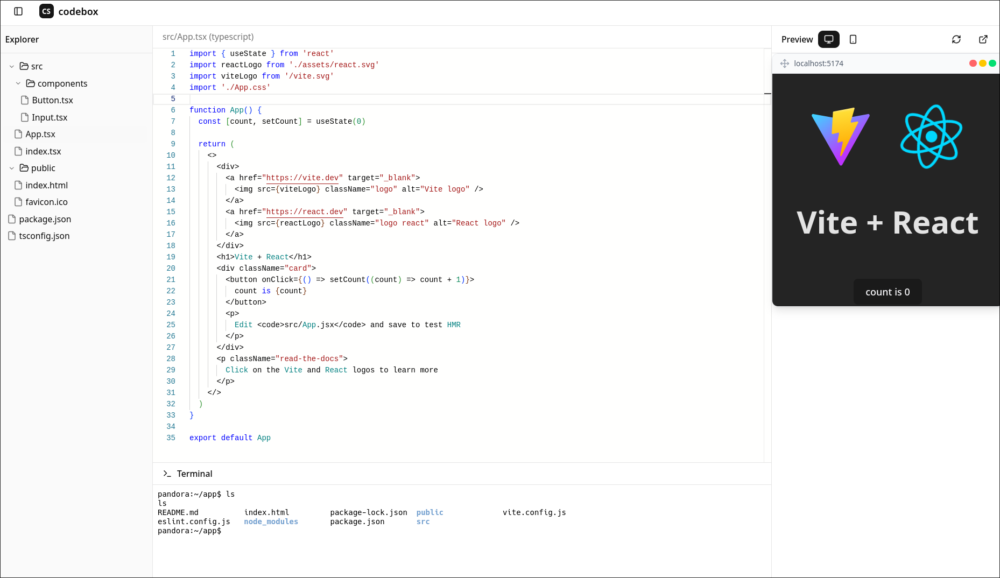

# codebox

> I don't plan to host this application. If the link is broken, then please refer to the usage guide.

<details>
    <summary>Images</summary>
    
</details>

### Usage
 clone the repository:

   ```shell
   git clone https://github.com/arpnghosh/codebox.git
   ```
### Client
   ```shell
   cd client
   npm install
   npm run dev
   ```
### Building the docker image
   ```shell
   cd server
   docker build -t codebox-image .
   ```
### Server
   ```shell
   cd server
   npm install
   npm run dev
   ``````
## Contributing

- [Open an issue](https://github.com/arpnghosh/codebox/issues) if you believe you've encountered a bug.
- Make a [pull request](https://github.com/arpnghosh/codebox/pull) to add new features/make quality-of-life improvements/fix bugs.
  
## License
This project is licensed under the [MIT License](LICENSE.md).
